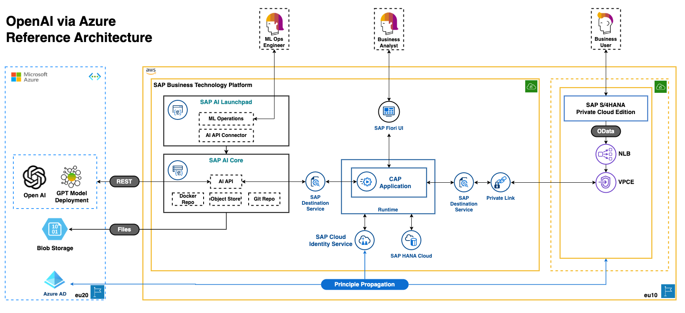

# Reference architecture of an SAP BTP CAP application using GPT Models of OpenAI

You want to make use of one of the Large Language Models (LLMs) like the GPT family of LLMs offered by Microsoft Azure OpenAI in combination with an application running on SAP Business Technology Platform (BTP), here is our recommendation how to achieve this and also benefit from the BTP capabilities.

## Potential Use Cases

Why would you want to do this? The list of potential use cases for LLMs is endless, here just a few examples:
* Generate proposals or recommendations of common topics, e.g. "what can I do to reduce my CO2 footprint in the context of a vegan diet"
* Generate email text for a fixed purpose and enrich it with data from your application or the ERP system
* Classify free text input or incoming mails into predefined categories
* Combine the language processing power of an LLM with the search on domain specific data or documents
* ... see the [The ChatGPT Cheat Sheet](https://drive.google.com/file/d/1OcHn2NWWnLGBCBLYsHg7xdOMVsehiuBK/view) or similar resources for more

## The Reference Architecture

The major cornerstones of the architecture skeched below are
* [GPT Model of Azure OpenAI Services](#gpt-model-of-openai)
* [SAP AI Core Service](#ai-core)
* [CAP Application](#cap-application)

:link: [Reference Architecture (.drawio) source file](architectures/ReferenceArchitectureOpenAI-ChatGPT.drawio)

### GPT Model on Azure OpenAI Services

In principal, we could use any LLM or similar powerful service available as an offering by one of the hyperscalers. In this case, we are referring to GPT-3 or newer instances of GPT originating from Open AI. These are deployed on the Azure infrastructure by Microsoft and accessible remotely via API.

### [SAP AI Core](https://help.sap.com/docs/AI_CORE/2d6c5984063c40a59eda62f4a9135bee/88e007863ca545438e274cbf6ce2d7c6.html)

SAP AI Core is a service in the SAP Business Technology Platform which is designed to handle the execution and operations of your AI assets in a standardized, scalable, and hyperscaler-agnostic way. It provides seamless integration with your SAP solutions. Any AI function can be easily realized using open-source frameworks. SAP AI Core supports full lifecycle management of AI scenarios.

API access to Large Language Models such as Microsoft Azure OpenAI is offered through our SAP AI Core which abstracts the model API – this offers three primary benefits: 
* You can add SAP context via “prompt” – this ensures that your input and intended output from the model is curated for SAP data;
* Context validation – ensures that your BTP application user’s input is validated before it is passed on to the model;
* Portability – should you wish to swap out GPT for any other LLMs out there in the market, you can do it without having to rewrite your application 
* For more advanced use cases, when combining domain specific models with LLMs e.g. for search on only localy available domain specific documents, the model can be taken care by SAP AI Core. Especially in those cases, the training and model management infrastructure and  GPU acceleration can come very handy, see also [SAP AI Core - Service Guide chapter 4](https://help.sap.com/doc/c31b38b32a5d4e07a4488cb0f8bb55d9/CLOUD/en-US/f17fa8568d0448c685f2a0301061a6ee.pdf)

In a first and simple approach here, we use SAP AI Core to act as an proxy to access the external AI services and to expose a destination which can be consumed by your application.

### [CAP Application](https://cap.cloud.sap/docs/)

SAP's recommendation is to use Cloud Application Programming ([CAP](https://cap.cloud.sap/docs/)) as the entitiy layer of the application and [SAP UI5](https://ui5.sap.com/) if a user interface is required. 

The application can of course also use a destination and the [SAP Destination Service](https://discovery-center.cloud.sap/serviceCatalog/destination?service_plan=lite&region=all&commercialModel=cloud) to connect to an LOB application like S/4HANA.

The most important part in our example is the connection to the external AI service via AI Core. AI Core provides a service which can be accessed through the respective destination.

Additionally, with this architecture you can benefit from the co-engineering work we have done with hyperscalers on SSO/Principal Propagation and [SAP Private Link Service](https://help.sap.com/docs/PRIVATE_LINK/42acd88cb4134ba2a7d3e0e62c9fe6cf/6c7c8a9282e344979295efb882637cd4.html) so that your data is secured within the network backbone and does not exit to the public internet.

## Examples

To understand this architecture approach in detail, we recommend to review our example [(Consume OpenAI services (GPT) through CAP & SAP BTP, AI Core)](https://github.com/SAP-samples/azure-openai-aicore-cap-api) which demonstrates the described architecture in a minimal way as boilerplate code.

The [Smart Co2nverter](https://github.com/SAP-samples/smart-co2nverter-ai) is an example of how the reference architecture for Azure OpenAI services can be implemented through the above boilerplate code, demonstrating its real-world capabilities: A mobile application enabling bank customers to be more climate conscious while strengthening their loyalty to the bank.

 
 
## Further References

* [The ChatGPT Cheat Sheet](https://drive.google.com/file/d/1OcHn2NWWnLGBCBLYsHg7xdOMVsehiuBK/view)
* [Sample SAP BTP CAP application](https://github.com/SAP-samples/btp-build-resilient-apps)
* [SAP CAP](https://cap.cloud.sap/docs/) - [Blog on CAP starting point](https://blogs.sap.com/2018/10/10/application-programming-model-start-here/)
* [SAP UI5](https://ui5.sap.com/) - [Blog on SAP UI5 starting point](https://blogs.sap.com/2021/08/23/what-is-sapui5/)
* [SAP Destination service](https://discovery-center.cloud.sap/serviceCatalog/destination?service_plan=lite&region=all&commercialModel=cloud)
* [Connectivity Service](https://discovery-center.cloud.sap/serviceCatalog/connectivity-service?service_plan=lite&region=all&commercialModel=cloud)
